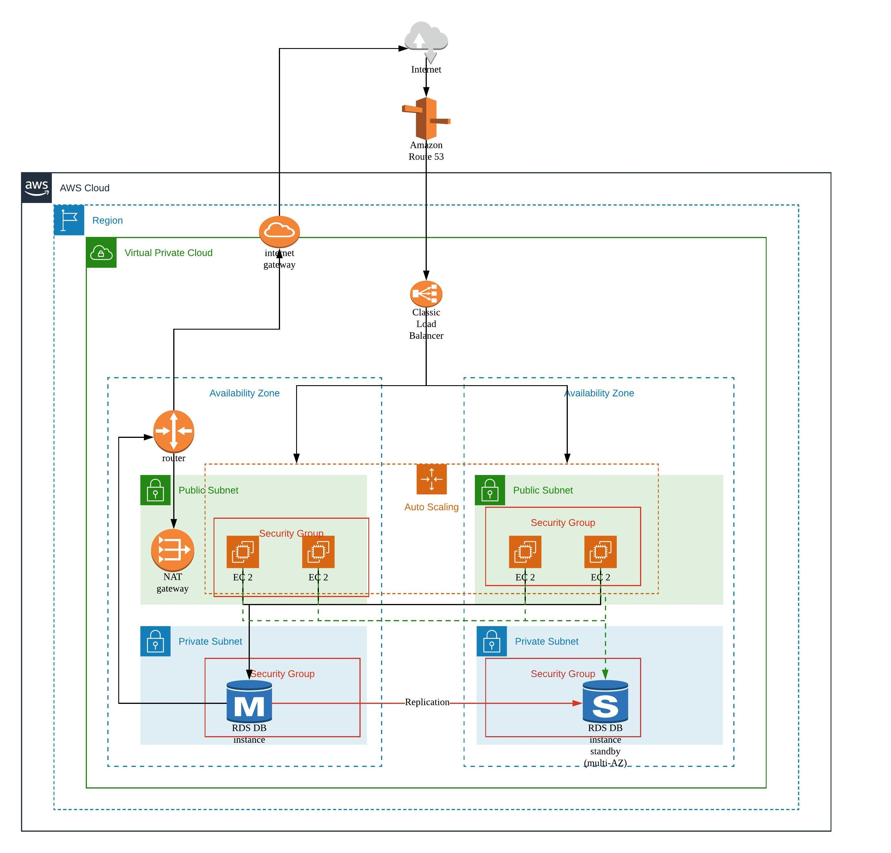

# Techhunt Assignments

This is my attempt at two part tech hunt assignment.

## 1. AWS Architecture Assignment.

[see assignment](docs/Symbiosis_Challenge.pdf)

Below is the diagram to support requirements. Application layer is migrated from on premise to VMs on AWS. 
This represents traditional lift and shift approach. This will allow cost reductions cutting down server costs by enabling elastic scaling and cutting down operational cost with managed database instances. 
Next steps will be to understand applications in details to see if they how they can be modified to be hosted in containers or lambdas. This will help to further cut down on operational costs.

[view on Lucid chart](https://app.lucidchart.com/documents/view/11801563-f060-4f66-afed-7e3db07bf1cc)

    
## 2. Web Application Development 

[see assignment](docs/TechHunt_TakeHome_Assessment.pdf) 

MVP scope for a salary management system.

Application consists of two main compoents
 * API - implemented in ASP.NET Core
 * UI -  implemented in Angular 10

Decision taken through the journey can be seen [here](docs/decision-log.md)

Both components are dockerized. Please follow the steps below to build and run the application.

### 2.1 Pre-requites 
1. Docker Desktop
2. build/ run scripts are in .bat extension. If you are on a different OS you may need to copy the commands in the bat files and run them on terminal 

### 2.2 Build 
1. Clone the git repository
2. Open a command prompt with admin priviledges, and browse to the root of the repository on your PC.
3. Run build.bat file.

### 2.3 Run
1. Once you are finished with above steps execute the run.bat file.
2. Go to [http://localhost:4200/](http://localhost:4200/) to view the application
3. API is awailable on http://localhost:5000/users

### 2.4 Stopping Services
1. run stop.bat.